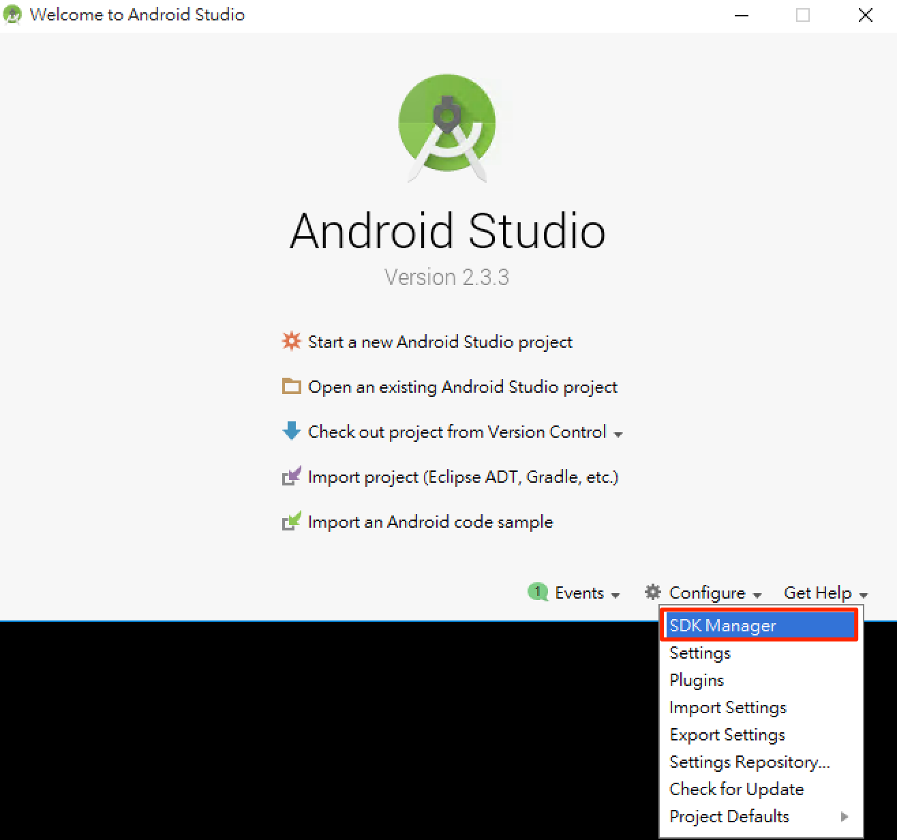
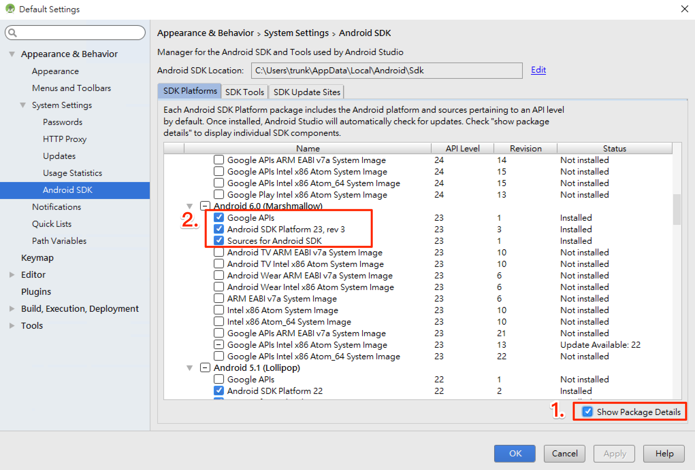
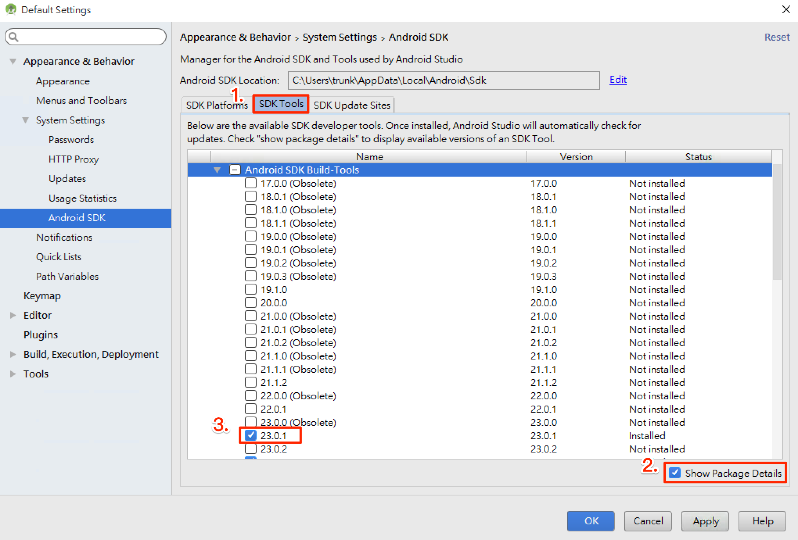
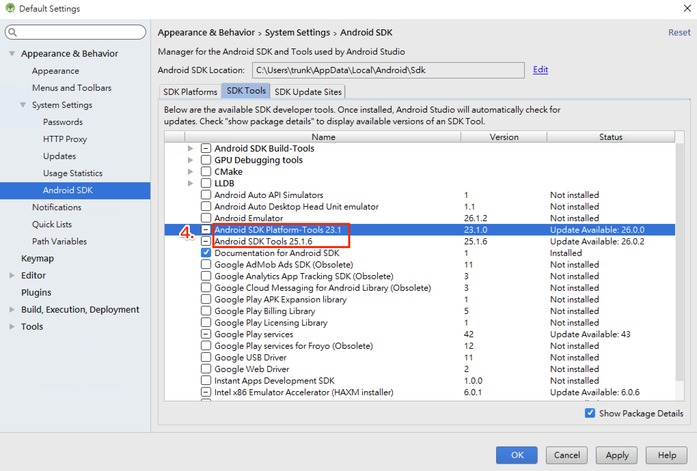
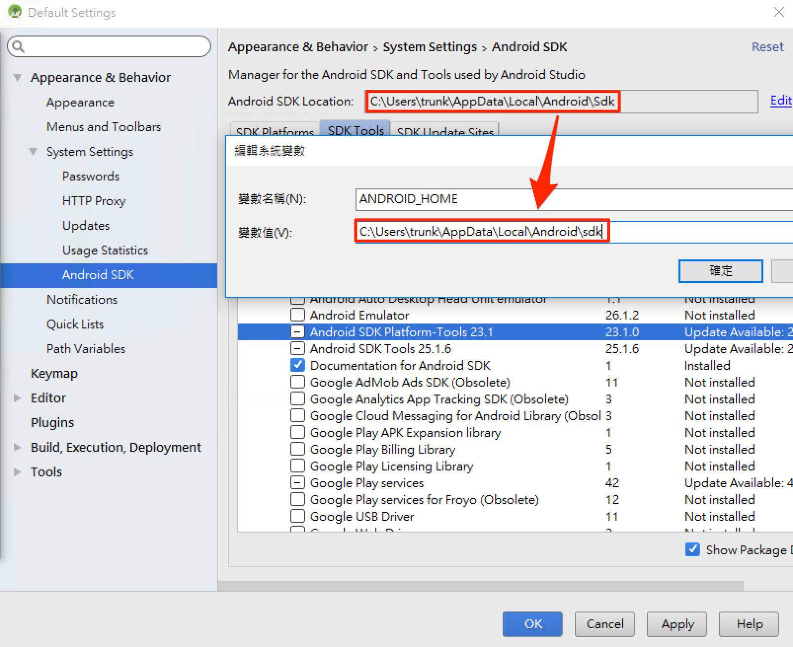
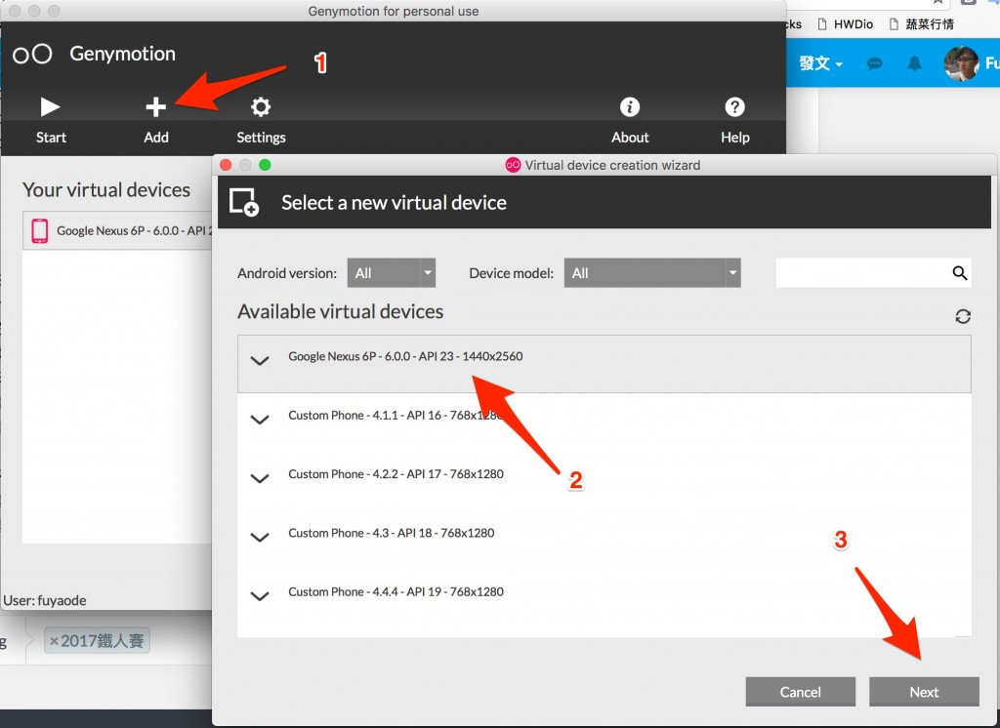
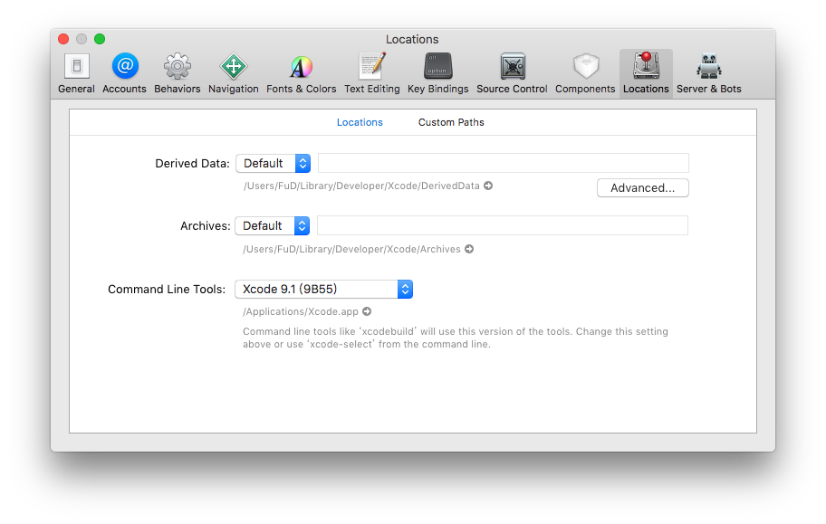

# 開發環境
基本系統環境

- python2
- jdk8
- Homebrew

## Node

### install NVM
Node Version Manager, 管理 Node 的工具，

**Windows**
- [nvm-windows](https://github.com/coreybutler/nvm-windows)

**Mac**
```
curl -o- https://raw.githubusercontent.com/creationix/nvm/v0.33.6/install.sh | bash
```

設定環境變數 (~/.bash_profile, ~/.zshrc, ~/.profile, or ~/.bashrc)
```
export NVM_DIR="$HOME/.nvm"
[ -s "$NVM_DIR/nvm.sh" ] && . "$NVM_DIR/nvm.sh" # This loads nvm
```

`source ~/.bashrc`

### install Node

```
nvm install 8
```

## Android SDK
React Native 目前需要 Android Studio2.0 或更高版本。

- 下載 [Windows Android Studio](https://developer.android.com/studio/index.html)
- 安裝 Android Studio - [教學影片](https://developer.android.com/studio/install.html)
- 安裝 SDK

SDK Platforms 選擇 **Google APIs** 、 **Android SDK Platform 23**

SDK Tools 選擇 **Android SDK Build-Tools 23.0.1**



### Android 環境變數
確保 ANDROID_HOME 環境變數跟 SDK 路徑一致  

**Windows**  
控制台 > 系統及安全性 > 進階系統設定 > 進階 > 環境變數 > 新增


控制台 > 系統及安全性 > 進階系統設定 > 進階 > 環境變數 > 選擇 PATH > 編輯
在後方新增  
`;C:\Users\使用者名稱\AppData\Local\Android\sdk\platform-tools;C:\Users\使用者名稱\AppData\Local\Android\sdk\tools`

**Mac**
開起 ~/.bashrc 或 ~/.zshrc 或 ~/.profile 在最後加上
```
export ANDROID_HOME=${HOME}/Library/Android/sdk
export PATH=${PATH}:${ANDROID_HOME}/tools
export PATH=${PATH}:${ANDROID_HOME}/platform-tools
```
## Android 虛擬機

- 註冊、下載 [genymotion](https://www.genymotion.com/pricing-and-licensing/)
- 新增虛擬機


# Xcode
- 從 App Store 安裝 Xcode
- 安裝 Xcode Command Line Tools, Xcode > ToolBar > Locations > Preferences

- `xcode-select -p`，確認是否有安裝完成，安裝完成會回傳 `/Applications/Xcode.app/Contents/Developer`
- brew install watchman - 

## 開發環境
- VS code
  - [React Native Tools](https://marketplace.visualstudio.com/items?itemName=vsmobile.vscode-react-native)
  - [ESLint](https://marketplace.visualstudio.com/items?itemName=dbaeumer.vscode-eslint)
    - [設定 AirBnb EsLint](eslint.md)

## 免環境快速練習

### CRNA
```
npm install -g create-react-native-app
create-react-native-app AwesomeProject
cd AwesomeProject
npm start
```

### Expo snack
[https://snack.expo.io/](https://snack.expo.io/)

## VM 使用教學

[Genymotion、ADB (Mac)](https://drive.google.com/open?id=0B8Q6P_xVwRg9a08zTVNCUHMxZlk)

[Genymotion、ADB (Windows)](https://drive.google.com/open?id=0B8Q6P_xVwRg9MzhsaGViTzJMR0k)

[C9 環境](https://drive.google.com/file/d/0B8Q6P_xVwRg9X3J4bHFDSU5taE0/view?usp=sharing)

[Android 模擬器](https://drive.google.com/open?id=0B8Q6P_xVwRg9YnVvOEtRMU9pc00)

**注意有先後順序之分**
- 開啟 Genymotion
- 開啟 Genymotion 當中的 Android 虛擬機 **Custom Phone - 7.1.0 - API 25 - 768x1280**，等待開機完成
- 在 `本機` 電腦執行命令提示字元執行指令
  ```
  $ adb devices
  $ adb tcpip 5556
  ```
- 開啟 VirtualBox 當中的 HelloJS-RNC9 
- HelloJS-RNC9 出現 login 字樣，開啟網頁 http://localhost:9083/ide.html
- 到 ` HelloJS-RNC9 terminal` 視窗輸入指令
  ```
  $ adb connect $ip:5556
  $ adb devices
  /* 測試是否有連上 */
  $ adb shell am start -a android.settings.SETTINGS
  ```

## 常見問題
[常見問題](http://bbs.reactnative.cn/topic/130/%E6%96%B0%E6%89%8B%E6%8F%90%E9%97%AE%E5%89%8D%E5%85%88%E6%9D%A5%E8%BF%99%E9%87%8C%E7%9C%8B%E7%9C%8B-react-native%E7%9A%84%E5%B8%B8%E8%A7%81%E9%97%AE%E9%A2%98)

## 延伸閱讀
* 官方文件 [Android 開發環境 - for Mac](http://facebook.github.io/react-native/releases/0.44/docs/getting-started.html#android-development-environment)
* 官方文件 [Android 開發環境 - for Windows](http://facebook.github.io/react-native/releases/0.44/docs/getting-started.html#android-development-environment)
* [簡中環境教學](http://reactnative.cn/docs/0.47/getting-started.html)
