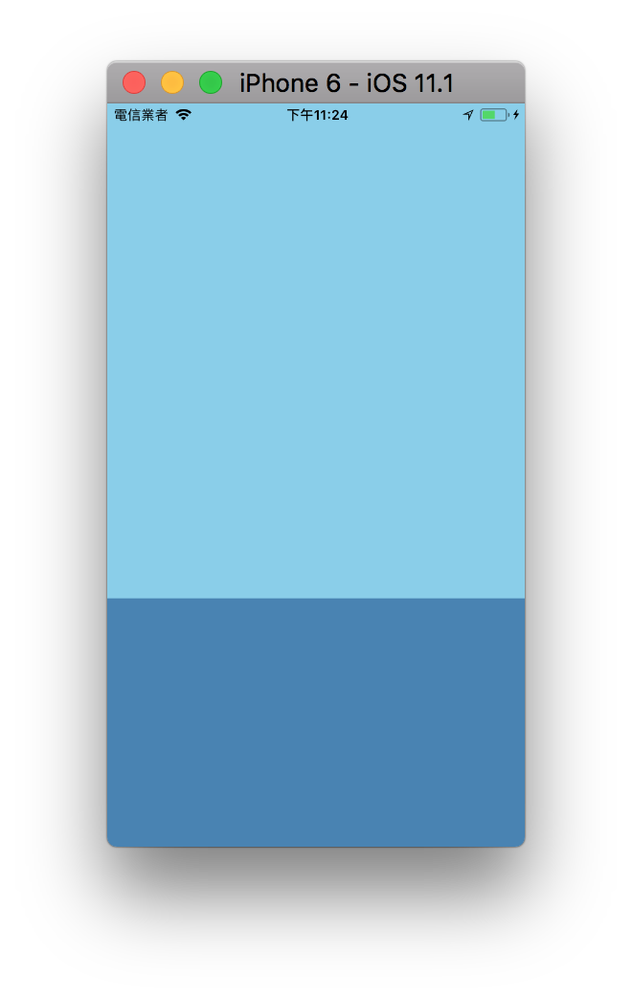
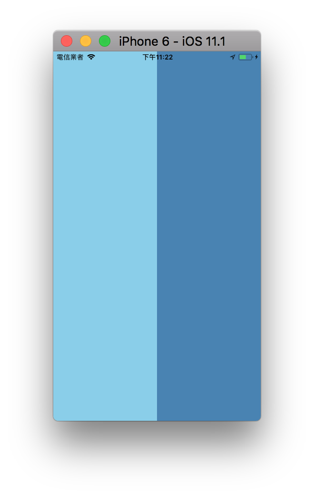
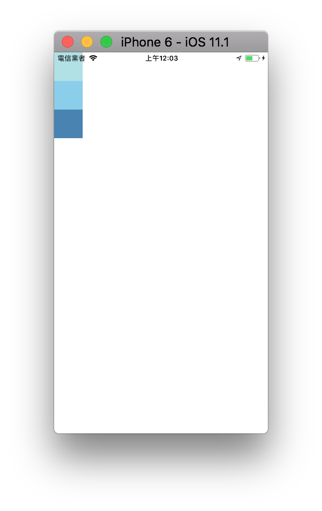
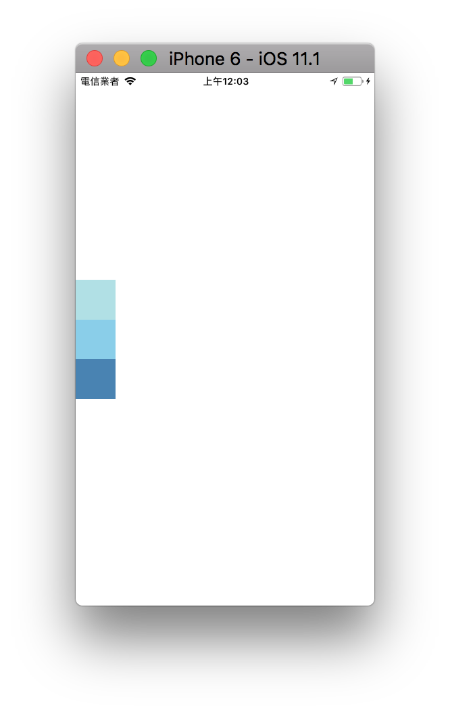
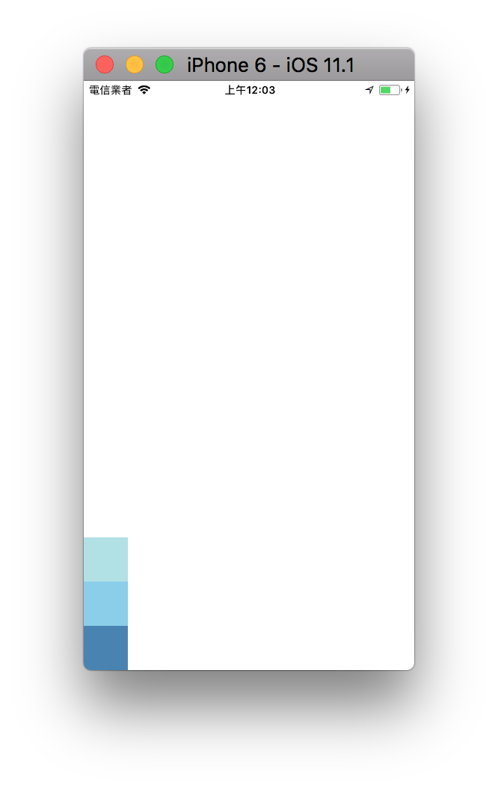
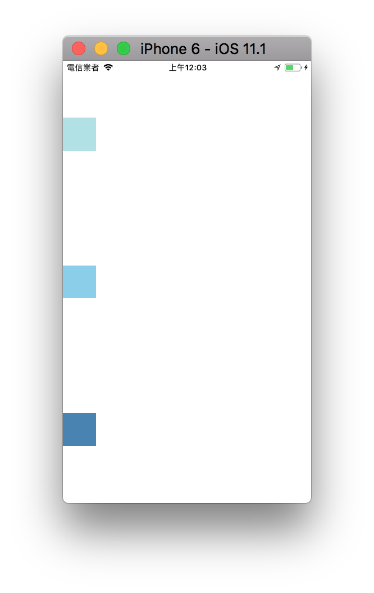
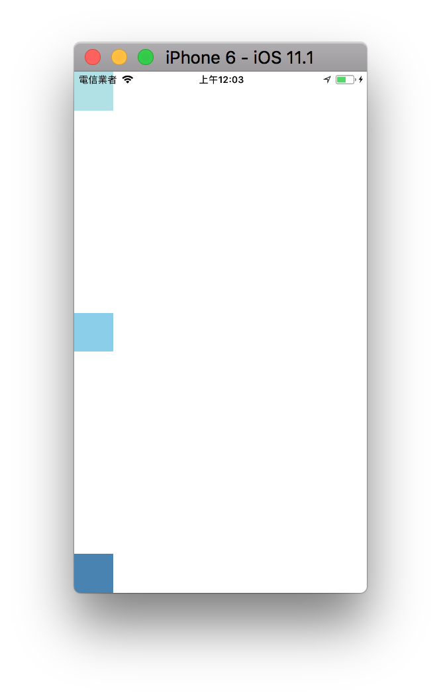
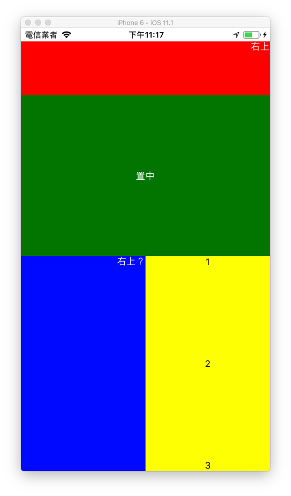

# Flex

Flexbox，就可以在不同屏幕尺寸上提供一致的佈局結構。
雖然跟網頁 CSS 的 flex 很像，但是還是有些為的差異
例如: flexDirection 在網頁中預設是 row，在 RN 裡面預設為 column

flex 後面的數字代表所佔的比例

```javascript
<View style={{ flex: 1 }}>
  <View style={{ flex: 2, backgroundColor: 'skyblue' }}>
  </View>
  <View style={{ flex: 1, backgroundColor: 'steelblue' }}>
  </View>
</View>
```


**flexDirection**

決定佈局的 `主軸`可設定子元素是水平排列還是垂直排列
- column 垂直排列 (預設)
- row 水平排列

預設為垂直排列

```javascript
<View style={{ flex: 1 }}>
  <View style={{ flex: 1, backgroundColor: 'skyblue' }}>
  </View>
  <View style={{ flex: 1, backgroundColor: 'steelblue' }}>
  </View>
</View>
```


使用 flexDirection 設定為水平排列

```javascript
<View style={{ flex: 1, flexDirection: 'row' }}>
  <View style={{ flex: 1, backgroundColor: 'skyblue' }}>
  </View>
  <View style={{ flex: 1, backgroundColor: 'steelblue' }}>
  </View>
</View>
```


**justifyContent**

可以決定其子元素沿着 `主軸` 的排列方式
- flex-start 主軸起始位置
- center 主軸中心
- flex-end 主軸末端
- space-around 根據主軸均勻分布空白
- space-between 根據主軸均勻分布物件

flex-start

center

flex-start

flex-start

flex-start


**alignItems**
可以決定其子元素沿着 `次軸` 的排列方式
- flex-start 次軸起始位置
- center 次軸中心
- flex-end 次軸末端


## 使用範例
```
import React, { Component } from 'react';
import {
  StyleSheet,
  View,
  Image,
  Text,
} from 'react-native';

export default class FlexSample extends Component {
  render() {
    return (
      <View style={{ flex: 1  }}>
        <View style={{ flex: 1, backgroundColor: 'blue' }}>
          <View style={{  flex: 1, backgroundColor: 'red', flexDirection: 'column', justifyContent: 'flex-start', alignItems: 'flex-end' }}>
            <Text style={{ color: 'white'  }}>右上</Text>
          </View>
          <View style={{  flex: 3, backgroundColor: 'green', justifyContent: 'center', alignItems: 'center' }}>
            <Text style={{ color: 'white'  }}>置中</Text>
          </View>
        </View>
        <View style={{ flex: 1, flexDirection: 'row' , backgroundColor: 'blue' }}>
          <View style={{  flex: 1, backgroundColor: 'blue', flexDirection: 'row', justifyContent: 'flex-end', alignItems: 'flex-start' }}>
            <Text style={{ color: 'white'  }}>右上？</Text>
          </View>
          <View style={{  flex: 1, backgroundColor: 'yellow', alignItems: 'center', justifyContent: 'space-between'}}>
            <Text>1</Text>
            <Text>2</Text>
            <Text>3</Text>
          </View>
        </View>
      </View>
    );
  }
}
```

## 練習
[flexboxfroggy](http://flexboxfroggy.com/) - 用遊戲學習 css 的 flexbox
玩到第 12 關

## 延伸閱讀
[yoga](https://github.com/facebook/yoga) - Facebook 實作的跨平台 Flex library
