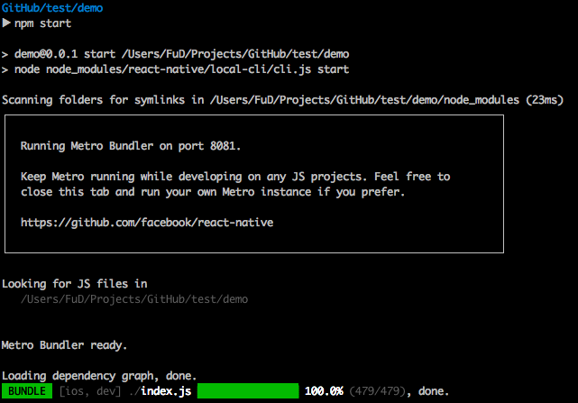

# 專案環境

## CLI

`$ npm install -g react-native-cli`

## 開新專案

```
$ react-native init demo
$ cd demo
$ npm start
$ react-native run-android
```

**react-native init**
- 新增乾淨的專案

**npm start**
- 開啟 Bundle server
  - Bundle server 負責把 JavaScaript 程式碼轉為 Native Code
  - 負責接收、傳送 Debug 訊息


**react-native run-android、react-native run-ios**
- 負責安裝開發模式的 react native app 至專案
- 出現 `BUILD SUCCEEDED` 字樣代表完成
- Android 編譯過 dev apk 後可直接使用下列指令安裝 apk 節省時間
`adb install ./android/app/build/outputs/apk/app-debug.apk`

## 專案結構
```
.
├── App.js
├── __tests__
├── android
├── app.json
├── index.js
├── ios
├── node_modules
├── package.json
└── yarn.lock
```

## 進入點
- App.js

```
import React, { Component } from 'react';
import {
  Platform,
  StyleSheet,
  Text,
  View
} from 'react-native';

const instructions = Platform.select({
  ios: 'Press Cmd+R to reload,\n' +
    'Cmd+D or shake for dev menu',
  android: 'Double tap R on your keyboard to reload,\n' +
    'Shake or press menu button for dev menu',
});

export default class App extends Component<{}> {
  render() {
    return (
      <View style={styles.container}>
        <Text style={styles.welcome}>
          Welcome to React Native!
        </Text>
        <Text style={styles.instructions}>
          To get started, edit App.js
        </Text>
        <Text style={styles.instructions}>
          {instructions}
        </Text>
      </View>
    );
  }
}

const styles = StyleSheet.create({
  container: {
    flex: 1,
    justifyContent: 'center',
    alignItems: 'center',
    backgroundColor: '#F5FCFF',
  },
  welcome: {
    fontSize: 20,
    textAlign: 'center',
    margin: 10,
  },
  instructions: {
    textAlign: 'center',
    color: '#333333',
    marginBottom: 5,
  },
});

```

## 除錯
### 開發人員選單
- iOS simulator: Cmd + D
- iOS device: 搖晃手機
- Android emulator: Cmd + M
- Android Devices: 搖晃手機

### 選單功能
- Debug JS Remote
  - 顯示除錯訊息
  - http://localhost:8081/debugger-ui
  - console.log 會直接顯示於 Developer Tools
- reload
- Hot reload
- Live Reload

## 常見問題

```
Packager can't listen on port 8081
```
解法: 有其他 React Native Bundle server 正在執行
