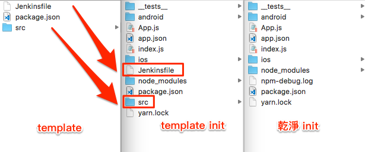

# Template
官方提供的自定義模板功能，可以在 `react-native init` 加上自己的模板

## 使用
```
react-native init ${project name} --template ${template name}

react-native init ${project name} --template file:///path_to/react-native-template-XXXX

react-native init ${project name} --template git://.../react-native-template-XXXX
```





## 定義模板
- 放入模板的架構
- 定義 package.json，使用 npm init，能快速產生 package.json
- 模板命名遵守命名規則 `react-native-template-` 開頭
- 發佈到 npm、git server


優點
- 程式碼共享，避免程式私有化
- 減少不必要的重工
- 快速開發 React native module
- 新人能快速上手新專案