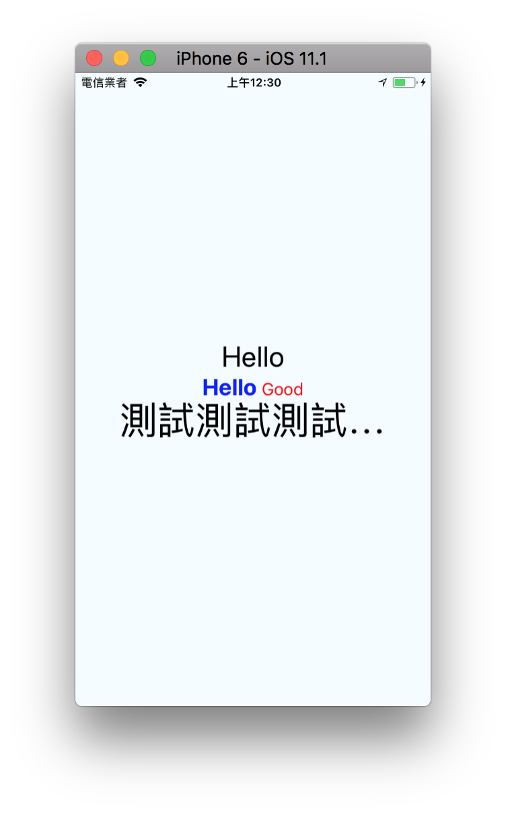

# Text
用於顯示文本的 React Component，並且它也支持嵌套、樣式，以及觸摸處理。
- 所有文字都需要使用 <Text> Component 包起來
- <Text> 可以互相嵌套樣式 

常用 style:
```
color: 顏色
fontSize: 字型大小
fontWeight: 字型寬度，'normal', 'bold', '100'~'900'(切記是字串)
textAlign: 對齊方式
```
常用 props:
```
allowFontScaling: 是否根據系統字型大小調整字型大小
numberOfLines: 根據 View 佈局換行最多行數，超過行數變為...
```

### 嵌套樣式、樣式繼承

```
<Text style={styles.baseText}>
  <Text style={styles.title}>HelloJS</Text>
  <Text style={styles.desc}> Good</Text>
</Text>
```

- React組件在概念上被設計為強隔離性的：你應當可以在應用的任何位置放置一個組件，而且只要屬性相同，其外觀和表現都將完全相同。文本如果能夠繼承外面的樣式屬性，將會打破這種隔離性。
- React Native的實現也被簡化了。我們不需要在每個元素上都添加一個fontFamily字段，並且我們也不需要隱含地在顯示文本的時候向上遍歷樹。唯一的樣式繼承在原生Text組件中編碼，也不會影響到其它組件或者係統本身


```
import React, { Component } from 'react';
import {
  View,
  Text,
  StyleSheet,
  Alert
} from 'react-native';

export default class TextSample extends Component {
  render() {
    return (
      <View style={styles.container}>
        <Text style={styles.text1}>Hello</Text>
        <Text style={styles.baseText}>
          <Text style={styles.title}>Hello</Text>
          <Text style={styles.desc}> Good</Text>
        </Text>
        <Text
          style={{ fontSize: 40 }}
          numberOfLines={1}
          onPress={() => {
            Alert.alert("阿!!", "你點到我了");
          }}
        >
          測試測試測試測試測試測試測試
        </Text>
      </View>
    );
  }
}

const styles = StyleSheet.create({
  container: {
    flex: 1,
    justifyContent: 'center',
    alignItems: 'center',
    backgroundColor: '#F5FCFF',
    padding: 30,
  },
  text1: {
    fontSize: 30,
  },
  baseText: {
    fontSize: 18,
    color: 'blue'
  },
  title: {
    fontSize: 24,
    fontWeight: 'bold',
  },
  desc: {
    color: 'red',
  }
})
```
